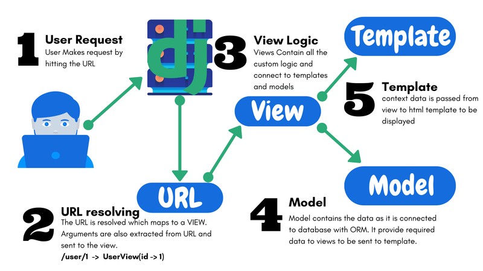

Don't forget to hit the :star: if you like this repo.

# Django
Django is a high-level web framework for building web applications in Python. It provides a powerful set of tools and libraries for building secure, scalable, and maintainable web applications quickly and efficiently. Django follows the Model-View-Controller (MVC) architectural pattern, and provides features such as an Object-Relational Mapper (ORM) for working with databases, a templating engine for rendering HTML pages, and a built-in admin interface for managing application content. With its rich ecosystem of third-party packages and plugins, Django is a popular choice for web developers around the world. [**More info..**](./materials/django)

## 🔥 Assignment ⚡

1. [Topic](./materials/assignment/topic.md)
2. [Instructions](./materials/assignment/assignment.md)

| No | Group |  Title |File |
| :-----: |------ | ------ | :-----: | 
| 1 | Rivertion | Student Information System |   | 
| 2 | CodeX | Booking System |   | 
| 3 | DataAce | Food Delivery System |   | 
| 4 | DataSphere | Blogging PLatform |   | 
| 5 | Gadgeteen | Online Education Platform |   | 
| 6 | MichelinStar | Social Network App |   | 
| 7 | Noctua | Job Portal |   | 
| 8 | Regex | E-Commerce Platform |   | 
| 9 | Rivertion | Student Information System |   | 
| 10 | StaticIP | Event Management System |   | 

## Python Web Frameworks

Python is a popular high-level programming language used for web development. It has gained popularity in recent years due to its simplicity, readability, and wide range of libraries and frameworks. Python web development involves the creation of web applications and websites using Python programming language. [**More info..**](./materials/pwf)

## Django Concept
Django is a high-level web framework for building web applications quickly and easily in Python. It follows the Model-View-Controller (MVC) architectural pattern and encourages the use of reusable code by providing a clean and consistent API. Django includes features such as an object-relational mapper (ORM) for working with databases, a templating engine for rendering HTML, built-in user authentication and security features, and support for handling HTTP requests and responses. Overall, Django simplifies web development by providing a comprehensive toolkit that helps developers focus on writing application logic rather than boilerplate code. [**More info..**](./materials/django)

## Django Key Points

| No | Topic | Description |
|----|---------------|---------------------------|
| 1 | [Setting up a Django Project](./materials/django/topic/1-setting.md) | Learn how to install and configure Django on your computer. |
| 2 | [Creating a Django App](./materials/django/topic/2-create.md) | Learn how to create a new Django app and add it to your project. |
| 3 | [Models in Django](./materials/django/topic/3-model.md) | Learn about Django's ORM and how to create models to represent your data. |
| 4 | [Views and Templates](./materials/django/topic/4-view.md) | Learn how to create views that handle requests and generate HTML using templates. |
| 5 | [URL routing in Django](./materials/django/topic/5-url.md) | Learn how to map URLs to views in your Django app. |
| 6 | [Forms in Django](./materials/django/topic/6-form.md) | Learn how to create HTML forms and handle user input with Django forms. |
| 7 | [Admin interface in Django](./materials/django/topic/7-admin.md) | Learn how to use Django's built-in admin interface for managing your app's data. |
| 8 | [Authentication and Authorization in Django](./materials/django/topic/8-authentication.md) | Learn how to add user authentication and authorization to your Django app. |
| 9 | [Deploying a Django app](./materials/django/topic/9-deploying.md) | Learn how to deploy your Django app to a production server. |

## Data science project using Django

| Project Name | Description | Real Case Study |
| --- | --- | --- |
| Customer Segmentation | Use clustering algorithms to segment customers based on their behavior and characteristics. | A clothing company wants to identify different customer segments based on their purchase history and behavior, to create targeted marketing campaigns for each segment. |
| Predictive Analytics | Use machine learning models to make predictions about future outcomes based on historical data. | A healthcare company wants to predict the likelihood of a patient developing a certain condition based on their medical history and other demographic factors. |
| Recommender System | Use machine learning algorithms to recommend products or services to users based on their preferences and behavior. | An e-commerce website wants to recommend products to users based on their purchase history, browsing behavior, and other demographic factors. |
| Fraud Detection | Use machine learning models to identify fraudulent transactions based on historical data. | A financial institution wants to detect fraudulent transactions in real-time to prevent financial loss and protect their customers. |
| Sentiment Analysis | Use natural language processing techniques to analyze and classify text data based on the sentiment expressed. | A social media company wants to analyze the sentiment of user comments and posts to understand how users feel about their platform and identify areas for improvement. |

## Useful links

### 1. E-book
| Resource | Description |
| -------- | ----------- |
| [Django Project Blueprints](./materials/django/e-book.md#1-django-project-blueprints) | Django is a high-level web framework that eases the creation of complex, database-driven websites. It emphasizes on the reusability and pluggability of components, rapid development, and the principle of don't repeat yourself. It lets you build high-performing, elegant web applications quickly. There are several Django tutorials available online, which take as many shortcuts as possible, but leave you wondering how you can adapt them to your own needs.|
| [Django For Beginners](./materials/django/e-book.md#2-django-for-beginners) | Welcome to Django for Beginners, a project-based approach to learning web development with the Django web framework. In this book you will build five progressively more complex web applications, starting with a simple Hello, World app, progressing to a Pages app, a Message Board app, a Blog app with forms and user accounts, and finally a Newspaper app that uses a custom user model, email integration, foreign keys, authorization, permissions, and more. By the end of this book you should feel confident creating your own Django projects from scratch using current best practices. |
| [Django 4 by Example](./materials/django/e-book.md#3-django-4-by-example) | Django 4 by Example (4th edition) will guide you through the entire process of developing professional web applications with Django. The book not only covers the most relevant aspects of the framework, but it will also teach you how to integrate other popular technologies into your Django projects. |
| [Python Crash Course](./materials/django/e-book.md#4-python-crash-course-3rd-edition) | Python Crash Course is the world’s best-selling guide to the Python programming language. This fast-paced, thorough introduction will have you writing programs, solving problems, and developing functioning applications in no time.|

### 2. Github Repository

| Github| Description |
| --- | --- | 
| [Django Girls website](https://github.com/DjangoGirls/djangogirls) | A blog website created by the Django Girls organization that teaches beginners how to build a blog using Django. |
| [MDN Django Tutorial ](https://github.com/mdn/django-locallibrary-tutorial)  | A tutorial website created by Mozilla that teaches how to build a library website using Django. |
| [Awesome Django](https://github.com/shahraizali/awesome-django)  | An awesome package is one that is mature, is well maintained, has a good amount of users, has good documentation, follows the best practices, and which latest release is less than 1 year old. Awesome Django packages and projects are the ones that inspire and serve as examples. |
| [Django Girls Tutorial Extensions](https://github.com/DjangoGirls/tutorial-extensions) | A collection of tutorials that extend the Django Girls tutorial and cover additional topics. | 

### 3. Website

| Resource | Description |
| -------- | ----------- |
| [Django's official website](https://docs.djangoproject.com/en/4.2/) | Django's documentation has a list of sample projects and code snippets that you can use to learn Django. This is a great place to start for beginners. |
| [GitHub](https://github.com/django/djangoproject.com) | GitHub is a popular code hosting platform where developers can collaborate on projects. You can search for Django projects and find ones with the "good first issue" label, which means they are beginner-friendly. |
| [DjangoGirls Tutorial](https://tutorial.djangogirls.org/en/) | DjangoGirls is a nonprofit organization that aims to teach women and girls how to code using Django. They offer a free tutorial that teaches you how to build a blog application using Django. |
| [Real Python](https://realpython.com/get-started-with-django-1/) | Real Python is a website that offers tutorials and courses on Python and Django. They have a free course that teaches you how to build a simple Django project. |

### Web
- [Meet Django](https://www.djangoproject.com/)
- [Github: django](https://github.com/django/django)
- [Django Tutorial: w3schools](https://www.w3schools.com/django/index.php)
- [Setup Django in Visual Studio Code: 2023 Edition](https://youtu.be/f1NQnhFFV-E)
- [A Practical Introduction to Web Scraping in Python](https://realpython.com/python-web-scraping-practical-introduction/)
- [Creating and Viewing HTML files with Python](https://www.geeksforgeeks.org/creating-and-viewing-html-files-with-python/)
- [Running Django on Google Colab](https://medium.com/@arsindoliya/running-django-on-google-colab-ea9392cdee86)
- [Django tutorial](https://www.w3schools.com/django/index.php)
- [9 Best Django Website Templates 2023](https://adminlte.io/blog/django-website-templates/)
- [College Management System using Django – Python Project](https://www.geeksforgeeks.org/college-management-system-using-django-python-project/)
- [Best Python Django Tutorial For Beginners – With Project Structure](https://data-flair.training/blogs/python-django-tutorial/)
- [Django Dashboards — Open Source and Free](https://medium.com/@appseed.us/django-dashboards-open-source-and-free-projects-1d8e64919e6d)

#### Django: Project
- [Build a Social Media App with Django – Python Web Framework Tutorial](https://youtu.be/xSUm6iMtREA)
- 💻 [Source code:](https://github.com/tomitokko/django-social-media-website)
- 💻 [Template files](https://github.com/tomitokko/django-social-media-template)
These resources provide a range of options for beginners to find and learn from Django projects.

## Tools
Diagrams are visual representations of information or data that help convey complex concepts, processes or systems in a clear and concise manner. Flowcharts are diagrams that use shapes and arrows to illustrate the steps in a process or algorithm [**[More info...]**](https://github.com/drshahizan/software-engineering/blob/main/materials/tools.md).

| No | Tools |  File |
| :-----: |  ------ | :-----: | 
| 1 | Figma |   | 
| 2 | Draw.io|  | 
| 3 | Github Pages|  | 
| 4 | Behance|  | 
| 5 | Visual Studio Code|  | 
| 6 | Bootstrap Studio|  | 

## Contribution 🛠️
Please create an [Issue](https://github.com/drshahizan/learn-django/issues) for any improvements, suggestions or errors in the content.

You can also contact me using [Linkedin](https://www.linkedin.com/in/drshahizan/) for any other queries or feedback.

