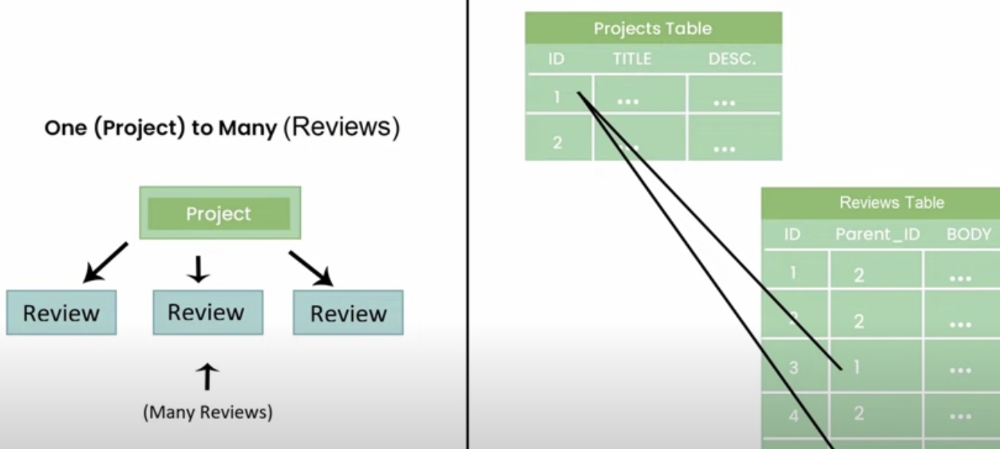

<a href="https://github.com/drshahizan/learn-django/stargazers"></a>
<a href="https://github.com/drshahizan/learn-django/network/members"></a>
<a href="https://github.com/drshahizan/learn-django/pulls"></a>
<a href="https://github.com/drshahizan/learn-django/issues"></a>
<a href="https://github.com/drshahizan/learn-django/graphs/contributors"></a>


Don't forget to hit the :star: if you like this repo.

# Django Model 

<p align="center">

</p>


This code snippet defines a Python class that inherits from the Django `models.Model` class. This means that the `project` class will have access to all the methods and attributes of the `models.Model` class, as well as any additional methods and attributes defined in the `project` class.

The `models.Model` class is a core component of the Django ORM (Object-Relational Mapping) system, which provides an interface between Python code and a relational database. Each class that inherits from `models.Model` represents a database table, and each attribute of the class represents a column in that table.

In this particular example, the `project` class has three attributes: `title`, `description`, and `id`. These correspond to the columns in the `project` table in the database.

The `title` attribute is defined as a `CharField`, which means it is a string with a maximum length of 255 characters. The `description` attribute is defined as a `TextField`, which means it is a string with no length limit. Finally, the `id` attribute is defined as a `UUIDField`, which is a field that stores a universally unique identifier.

By defining these attributes in the `project` class, we are telling Django how to map data between the Python objects and the database table. We can then use the Django ORM to perform operations on the database, such as querying for objects, creating new objects, updating existing objects, and deleting objects.

Overall, the Django ORM and `models.Model` class make it easy to work with relational databases in Python, without having to write SQL queries directly. This allows developers to focus on building their application logic, rather than worrying about the details of how data is stored and retrieved from the database.

## Example: One-to-many relationship
In Django, the relationship between a `Project` and its associated `Reviews` can be modeled as a one-to-many relationship using a foreign key field. 

<p align="center">

</p>

An example of how to define the `Project` and `Review` models in Django:

```python
from django.db import models

class Project(models.Model):
    title = models.CharField(max_length=255)
    description = models.TextField()

class Review(models.Model):
    parent_project = models.ForeignKey(Project, on_delete=models.CASCADE)
    body = models.TextField()
```

In this example, the `Project` model has two fields: `title` and `description`. The `Review` model has two fields as well: `body`, which is the text of the review, and `parent_project`, which is a foreign key field that links each review to its associated project.

The `ForeignKey` field is used to define a many-to-one relationship between the `Review` model and the `Project` model. By setting `parent_project = models.ForeignKey(Project, on_delete=models.CASCADE)`, we're telling Django that each review belongs to a single project, and that if the associated project is deleted, all of its associated reviews should also be deleted (`on_delete=models.CASCADE`).

With this model in place, we can perform various operations on the `Project` and `Review` objects using the Django ORM. For example, we can create a new project with associated reviews like this:

```python
# create a new project
p = Project.objects.create(title='My Project', description='This is my project description')

# create some reviews for the project
r1 = Review.objects.create(parent_project=p, body='This project is great!')
r2 = Review.objects.create(parent_project=p, body='I really enjoyed working on this project')
```

We can also query for all the reviews associated with a particular project:

```python
# get all the reviews for a project
reviews = Review.objects.filter(parent_project=p)
```

Overall, modeling a one-to-many relationship between a `Project` and its associated `Reviews` in Django is straightforward using a foreign key field. This allows us to easily perform operations on the data using the Django ORM.

## Example: Many-to-many relationship

In Django, a many-to-many relationship between `Tags` and `Products` can be modeled using an intermediary table. This table contains foreign keys to both the `Tags` and `Products` tables, and represents the relationship between the two tables.

<p align="center">

</p>

Here's an example of how to define the `Product`, `Tag`, and intermediary `ProductTag` models in Django:

```python
from django.db import models

class Product(models.Model):
    title = models.CharField(max_length=255)
    description = models.TextField()
    tags = models.ManyToManyField('Tag', through='ProductTag')

class Tag(models.Model):
    title = models.CharField(max_length=255)
    description = models.TextField()

class ProductTag(models.Model):
    product = models.ForeignKey(Product, on_delete=models.CASCADE)
    tag = models.ForeignKey(Tag, on_delete=models.CASCADE)
```

In this example, the `Product` model has a many-to-many relationship with the `Tag` model, which is defined using the `tags` field. This field specifies that a product can have many tags, and that the relationship between `Product` and `Tag` is managed by the `ProductTag` model.

The `ProductTag` model is an intermediary model that contains foreign keys to both the `Product` and `Tag` models. This model represents the relationship between the two tables, and allows us to add additional information to the relationship, such as a timestamp or a flag indicating whether the tag is the primary tag for the product.

With this model in place, we can perform various operations on the `Product`, `Tag`, and `ProductTag` objects using the Django ORM. For example, we can create a new product with associated tags like this:

```python
# create a new product
p = Product.objects.create(title='My Product', description='This is my product description')

# create some tags for the product
t1 = Tag.objects.create(title='Tag 1', description='This is tag 1')
t2 = Tag.objects.create(title='Tag 2', description='This is tag 2')

# associate the tags with the product
pt1 = ProductTag.objects.create(product=p, tag=t1)
pt2 = ProductTag.objects.create(product=p, tag=t2)
```

We can also query for all the tags associated with a particular product:

```python
# get all the tags for a product
tags = p.tags.all()
```

Overall, modeling a many-to-many relationship between `Tags` and `Products` in Django is straightforward using an intermediary table. This allows us to easily perform operations on the data using the Django ORM.

## Contribution 🛠️
Please create an [Issue](https://github.com/drshahizan/learn-django/issues) for any improvements, suggestions or errors in the content.

You can also contact me using [Linkedin](https://www.linkedin.com/in/drshahizan/) for any other queries or feedback.

[](https://visitorbadge.io/status?path=https%3A%2F%2Fgithub.com%2Fdrshahizan)


