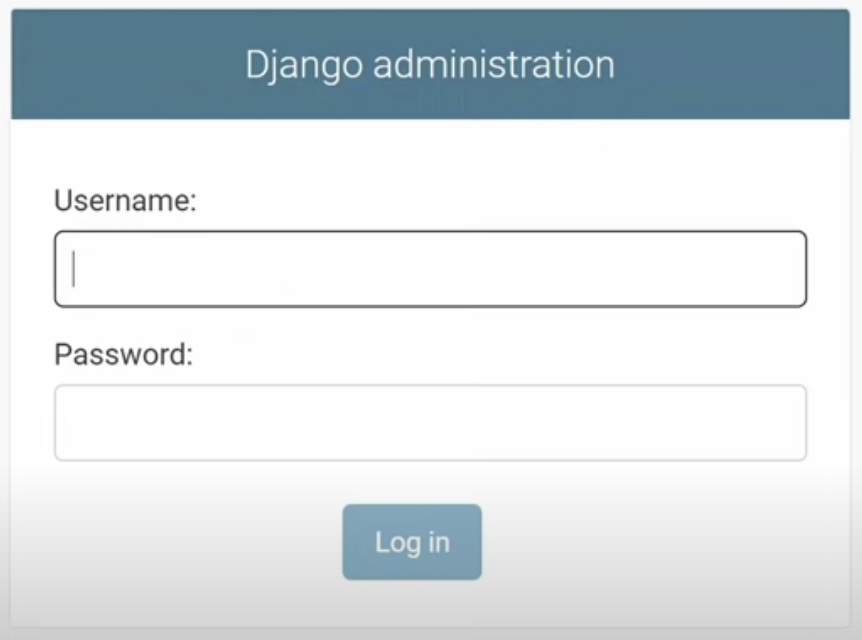
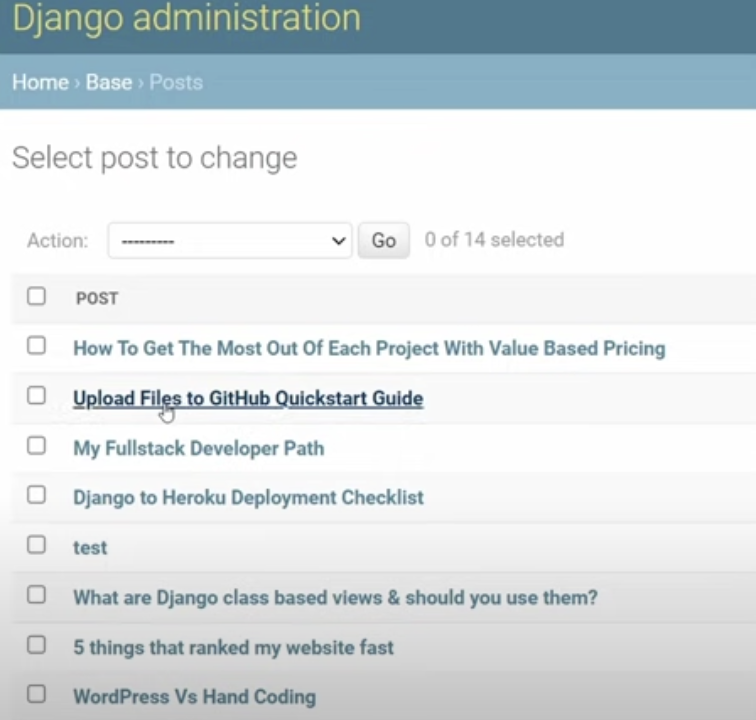

Don't forget to hit the :star: if you like this repo.

# Django Admin Panel

The Django Admin Panel is a built-in application that provides a web-based interface for managing a Django application. It allows authorized users to view, add, edit, and delete data from the database without writing any code.

The Django Admin Panel is automatically generated based on the models defined in the application. Once the models are defined, the Admin Panel can be customized to meet specific needs by defining a ModelAdmin class. 

The Admin Panel consists of two main sections:

1. Django Administration: This section is the built-in administrative interface for the Django framework. It provides access to the system-level administration features such as user authentication, groups, permissions, and site settings.

2. Site Administration: This section provides access to the application-level administration features. It allows authorized users to perform CRUD (Create, Read, Update, Delete) operations on the application's data using a web-based interface. 

The Site Administration section is based on the ModelAdmin class, which defines how the models should be displayed in the Admin Panel. ModelAdmin class allows customization of the admin panel by providing options such as list_display, list_filter, search_fields, and actions. These options allow the developers to control which fields are displayed, how they are sorted, and how the data is filtered. 

Overall, the Django Admin Panel provides a convenient way for developers and administrators to manage and maintain Django applications without writing any custom code. It is a powerful tool that streamlines the development process and helps to improve productivity.

## Contribution 🛠️
Please create an [Issue](https://github.com/drshahizan/learn-django/issues) for any improvements, suggestions or errors in the content.

You can also contact me using [Linkedin](https://www.linkedin.com/in/drshahizan/) for any other queries or feedback.

