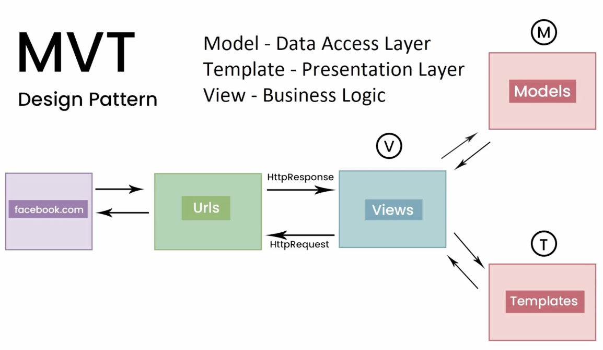
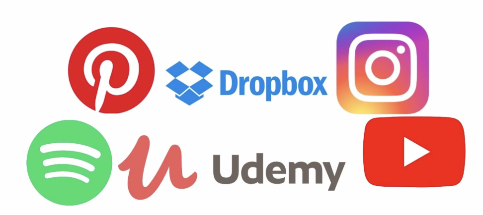

Don't forget to hit the :star: if you like this repo.

# Django Concept

Django is a web framework for building web applications in Python. It follows the Model-View-Controller (MVC) architectural pattern, where the Model represents the application's data and logic, the View is responsible for rendering the user interface, and the Controller handles user input and coordinates communication between the Model and View. 

In Django, the MVT (Model-View-Template) architecture is used to structure web applications. It is similar to the more well-known Model-View-Controller (MVC) architecture, but with a few key differences. Let's explore how the MVT pattern could be used in building Facebook using Django.

### Model
The Model is responsible for handling data and the database. In Facebook, this could include models for User, Page, Photo, and Friend. The model is where we define the fields that we want to store in the database, such as the user's name, email, and password.

### View
The View is responsible for handling user requests and returning a response. In Facebook, views would handle requests such as viewing a user's profile, creating a new post, or sending a message to a friend. Views can access the models to retrieve or update data as needed.

### Template
The Template is responsible for rendering the HTML that is returned to the user. In Facebook, templates would be used to create the visual layout of the site, such as the login page, news feed, and profile page. Templates use variables passed from the views to display dynamic content, such as the user's name or the number of likes on a post.

Using the MVT pattern, we can build a robust and scalable web application like Facebook. The model would handle data storage and retrieval, views would handle user requests, and templates would handle the visual layout of the site. With Django's built-in tools, we can quickly build and deploy a feature-rich web application that is secure, reliable, and easy to maintain.

## Topic

| Django Concept | Description |
|----------------------------|-----------------------|
| 1. [Django Project](./concept/1-project.md) | A collection of settings, URLs, and apps that defines the functionality of a Django web application. |
| 2. [Django Commands](./concept/2-commands.md)| Command-line tools that facilitate various tasks in a Django project, such as running the server, running tests, and creating database tables. |
| 3. [View function](./concept/3-view.md) | A Python function that takes an HTTP request and returns an HTTP response. It determines the content that is displayed to a user in a web application. |
| 4. [Django Model](./concept/4-model.md) | A Python class that represents a database table and its fields. It is used to define the schema of a database in a Django project. |
| 5. [Django ORM](./concept/5-orm.md) | An object-relational mapping (ORM) tool that maps Python objects to database tables and vice versa. It allows developers to interact with a database using Python code. |
| 6. [CRUD](./concept/6-crud.md) | An acronym for Create, Read, Update, and Delete, the four basic functions of persistent storage. In Django, these operations are typically performed using the Model class and ORM. |
| 7. [Django Admin Panel](./concept/7-admin.md) | A built-in application that provides a web-based interface for managing a Django project's data. It allows administrators to view, create, edit, and delete objects in the database. |
| 8. [Authentication and Authorization](./concept/8-authentication.md) | Two related processes that control access to a Django project. Authentication involves verifying the identity of a user, while authorization involves determining what actions that user is allowed to perform. |
| 9. [Static Files](./concept/9-static.md) | Files that are served directly to users by a web server, such as images, CSS stylesheets, and JavaScript files. In Django, these files are typically stored in a project's "static" directory. |
| 10. [Create Website using Django](./concept/10-website.md) | The process of building a web application using the Django web framework. This typically involves creating a Django project, defining models and views, creating templates, and configuring the project's URLs. |
| 11. [Key Features](./concept/11-key.md) | A list of features that make Django a popular choice for web development, including its built-in ORM, template engine, administration interface, and support for third-party packages. |

## Popular websites built using Django

| Website          | Description                                    |
| ---------------- | ---------------------------------------------- |
| Instagram        | Social media platform. Instagram's backend is built with Django, and it is one of the most popular social media platforms in the world. |
| Pinterest        | Visual discovery platform  that uses Django for its backend. |
| Mozilla          | Non-profit organization for Firefox web browser, uses Django for some of its web applications.|
| Dropbox          | Cloud storage and file sharing service, uses Django for some of its internal web applications.|
| Bitbucket        | Web-based version control repository hosting service that uses Django for its backend. |
| Spotify          | Music streaming service, uses Django for some of its internal web applications.|
| Eventbrite       | Event organizing and management platform|
| The Washington Post | One of the largest newspapers in the US, uses Django for some of its web applications.|
| NASA             | US space agency, , uses Django for some of its web applications.|
| Disqus           | Commenting platform for websites that uses Django for its backend.|

This is just a small sample of the many websites that are built using Django.

## Contribution 🛠️
Please create an [Issue](https://github.com/drshahizan/learn-django/issues) for any improvements, suggestions or errors in the content.

You can also contact me using [Linkedin](https://www.linkedin.com/in/drshahizan/) for any other queries or feedback.

