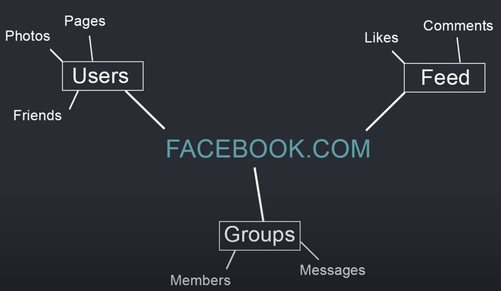

<a href="https://github.com/drshahizan/learn-django/stargazers"></a>
<a href="https://github.com/drshahizan/learn-django/network/members"></a>
<a href="https://github.com/drshahizan/learn-django/pulls"></a>
<a href="https://github.com/drshahizan/learn-django/issues"></a>
<a href="https://github.com/drshahizan/learn-django/graphs/contributors"></a>


Don't forget to hit the :star: if you like this repo.

# Django concept

Django is a web framework for building web applications in Python. It follows the Model-View-Controller (MVC) architectural pattern, where the Model represents the application's data and logic, the View is responsible for rendering the user interface, and the Controller handles user input and coordinates communication between the Model and View. 

## Django Project

In a Django project, the application logic is organized into individual apps. Each app typically consists of four main components: Models, Views, Templates, and URLs. Here's a brief overview of these components in the context of an example Django project called "App1":

<p align="center">

</p>

### 1. Models
Models define the data structure and relationships between database tables. In App1, the models might include classes such as "User" or "Post", which represent users and posts in the application. Models are defined in a file called "models.py" in the app directory.

### 2. Views
Views handle user requests and return HTTP responses. In App1, the views might include functions such as "list_posts" or "create_post", which display a list of posts or create a new post, respectively. Views are defined in a file called "views.py" in the app directory.

### 3. Templates
Templates define the HTML structure and layout of the application's user interface. In App1, the templates might include files such as "list_posts.html" or "create_post.html", which define the layout of the pages for listing posts or creating a new post, respectively. Templates are typically stored in a directory called "templates" within the app directory.

### 4. URLs
URLs map user requests to specific views. In App1, the URLs might include patterns such as "/posts/" or "/posts/create/", which map to the "list_posts" and "create_post" views, respectively. URLs are defined in a file called "urls.py" in the app directory.

<p align="center">

</p>

Overall, these components work together to define the functionality and user interface of the App1 web application. By organizing the application logic into separate apps, Django allows developers to build complex applications with a modular and maintainable codebase.

## Example of a view function in Django

Django is a high-level Python web framework that encourages rapid development and clean, pragmatic design. It is built on top of the Python programming language and follows the model-view-controller (MVC) architectural pattern.

In this particular example, the view function is called `profileView` and it takes a `request` object as its argument. The `request` object contains information about the current request, such as the user's browser, IP address, and any data they submitted in a form.

The first line of the view function imports the `render` function from the `django.shortcuts` module. The `render` function takes a request object, a template name, and a context dictionary as its arguments, and returns an HTTP response with the rendered template.

In the second line of the view function, the `getUser()` function is called to retrieve information about the current user. This function is not defined in the code snippet, but it is likely a custom function that retrieves user data from a database or other source.

Finally, the view function passes the `user` object to the `render` function as part of a context dictionary. This context dictionary allows variables to be passed from the view function to the template, where they can be displayed or manipulated as needed.

<p align="center">

</p>

Overall, Django provides a powerful set of tools for building web applications, including a robust ORM (Object-Relational Mapping) system, a built-in admin interface, and a templating engine for creating dynamic HTML pages. The framework also emphasizes best practices such as DRY (Don't Repeat Yourself) coding and secure development practices.

## Django models.Model class

<p align="center">

</p>


This code snippet defines a Python class that inherits from the Django `models.Model` class. This means that the `project` class will have access to all the methods and attributes of the `models.Model` class, as well as any additional methods and attributes defined in the `project` class.

The `models.Model` class is a core component of the Django ORM (Object-Relational Mapping) system, which provides an interface between Python code and a relational database. Each class that inherits from `models.Model` represents a database table, and each attribute of the class represents a column in that table.

In this particular example, the `project` class has three attributes: `title`, `description`, and `id`. These correspond to the columns in the `project` table in the database.

The `title` attribute is defined as a `CharField`, which means it is a string with a maximum length of 255 characters. The `description` attribute is defined as a `TextField`, which means it is a string with no length limit. Finally, the `id` attribute is defined as a `UUIDField`, which is a field that stores a universally unique identifier.

By defining these attributes in the `project` class, we are telling Django how to map data between the Python objects and the database table. We can then use the Django ORM to perform operations on the database, such as querying for objects, creating new objects, updating existing objects, and deleting objects.

Overall, the Django ORM and `models.Model` class make it easy to work with relational databases in Python, without having to write SQL queries directly. This allows developers to focus on building their application logic, rather than worrying about the details of how data is stored and retrieved from the database.

## Example: One-to-many relationship
In Django, the relationship between a `Project` and its associated `Reviews` can be modeled as a one-to-many relationship using a foreign key field. 

<p align="center">

</p>

An example of how to define the `Project` and `Review` models in Django:

```python
from django.db import models

class Project(models.Model):
    title = models.CharField(max_length=255)
    description = models.TextField()

class Review(models.Model):
    parent_project = models.ForeignKey(Project, on_delete=models.CASCADE)
    body = models.TextField()
```

In this example, the `Project` model has two fields: `title` and `description`. The `Review` model has two fields as well: `body`, which is the text of the review, and `parent_project`, which is a foreign key field that links each review to its associated project.

The `ForeignKey` field is used to define a many-to-one relationship between the `Review` model and the `Project` model. By setting `parent_project = models.ForeignKey(Project, on_delete=models.CASCADE)`, we're telling Django that each review belongs to a single project, and that if the associated project is deleted, all of its associated reviews should also be deleted (`on_delete=models.CASCADE`).

With this model in place, we can perform various operations on the `Project` and `Review` objects using the Django ORM. For example, we can create a new project with associated reviews like this:

```python
# create a new project
p = Project.objects.create(title='My Project', description='This is my project description')

# create some reviews for the project
r1 = Review.objects.create(parent_project=p, body='This project is great!')
r2 = Review.objects.create(parent_project=p, body='I really enjoyed working on this project')
```

We can also query for all the reviews associated with a particular project:

```python
# get all the reviews for a project
reviews = Review.objects.filter(parent_project=p)
```

Overall, modeling a one-to-many relationship between a `Project` and its associated `Reviews` in Django is straightforward using a foreign key field. This allows us to easily perform operations on the data using the Django ORM.

## Example: Many-to-many relationship

In Django, a many-to-many relationship between `Tags` and `Products` can be modeled using an intermediary table. This table contains foreign keys to both the `Tags` and `Products` tables, and represents the relationship between the two tables.

<p align="center">

</p>

Here's an example of how to define the `Product`, `Tag`, and intermediary `ProductTag` models in Django:

```python
from django.db import models

class Product(models.Model):
    title = models.CharField(max_length=255)
    description = models.TextField()
    tags = models.ManyToManyField('Tag', through='ProductTag')

class Tag(models.Model):
    title = models.CharField(max_length=255)
    description = models.TextField()

class ProductTag(models.Model):
    product = models.ForeignKey(Product, on_delete=models.CASCADE)
    tag = models.ForeignKey(Tag, on_delete=models.CASCADE)
```

In this example, the `Product` model has a many-to-many relationship with the `Tag` model, which is defined using the `tags` field. This field specifies that a product can have many tags, and that the relationship between `Product` and `Tag` is managed by the `ProductTag` model.

The `ProductTag` model is an intermediary model that contains foreign keys to both the `Product` and `Tag` models. This model represents the relationship between the two tables, and allows us to add additional information to the relationship, such as a timestamp or a flag indicating whether the tag is the primary tag for the product.

With this model in place, we can perform various operations on the `Product`, `Tag`, and `ProductTag` objects using the Django ORM. For example, we can create a new product with associated tags like this:

```python
# create a new product
p = Product.objects.create(title='My Product', description='This is my product description')

# create some tags for the product
t1 = Tag.objects.create(title='Tag 1', description='This is tag 1')
t2 = Tag.objects.create(title='Tag 2', description='This is tag 2')

# associate the tags with the product
pt1 = ProductTag.objects.create(product=p, tag=t1)
pt2 = ProductTag.objects.create(product=p, tag=t2)
```

We can also query for all the tags associated with a particular product:

```python
# get all the tags for a product
tags = p.tags.all()
```

Overall, modeling a many-to-many relationship between `Tags` and `Products` in Django is straightforward using an intermediary table. This allows us to easily perform operations on the data using the Django ORM.

## Django Object-Relational Mapping
Django ORM (Object-Relational Mapping) is a tool that provides a high-level, Pythonic interface for working with relational databases. The ORM allows developers to interact with the database using Python code instead of SQL statements. 

There are several methods available in the Django ORM for retrieving data from the database. Here are some of the commonly used methods:

### 1. `get()`
This method retrieves a single record from the database that matches the specified condition. For example, `MyModel.objects.get(id=1)` would retrieve the record from the `MyModel` table where the `id` column equals 1.

### 2. `all()`
This method retrieves all records from the specified table. For example, `MyModel.objects.all()` would retrieve all records from the `MyModel` table.

### 3. `filter()`
This method retrieves all records from the specified table that match the specified condition. For example, `MyModel.objects.filter(name='John')` would retrieve all records from the `MyModel` table where the `name` column equals 'John'.

Here is an example of how these methods can be used to retrieve data from a database:

```python
from myapp.models import MyModel

# Retrieve a single record from the database
record = MyModel.objects.get(id=1)

# Retrieve all records from the database
records = MyModel.objects.all()

# Retrieve all records from the database that match a specific condition
filtered_records = MyModel.objects.filter(name='John')
```

In addition to these methods, there are other methods available in the Django ORM for more complex queries, such as `exclude()`, `order_by()`, `annotate()`, and `aggregate()`. The Django ORM also supports raw SQL queries if needed.

Overall, the Django ORM provides a simple and convenient way to work with relational databases in Python, allowing developers to write database queries in a more Pythonic and readable way.

## Django Admin Panel

The Django Admin Panel is a built-in application that provides a web-based interface for managing a Django application. It allows authorized users to view, add, edit, and delete data from the database without writing any code.

<p align="center">

</p>


The Django Admin Panel is automatically generated based on the models defined in the application. Once the models are defined, the Admin Panel can be customized to meet specific needs by defining a ModelAdmin class. 

The Admin Panel consists of two main sections:

1. Django Administration: This section is the built-in administrative interface for the Django framework. It provides access to the system-level administration features such as user authentication, groups, permissions, and site settings.

<p align="center">

</p>

2. Site Administration: This section provides access to the application-level administration features. It allows authorized users to perform CRUD (Create, Read, Update, Delete) operations on the application's data using a web-based interface. 

<p align="center">

</p>

The Site Administration section is based on the ModelAdmin class, which defines how the models should be displayed in the Admin Panel. ModelAdmin class allows customization of the admin panel by providing options such as list_display, list_filter, search_fields, and actions. These options allow the developers to control which fields are displayed, how they are sorted, and how the data is filtered. 

Overall, the Django Admin Panel provides a convenient way for developers and administrators to manage and maintain Django applications without writing any custom code. It is a powerful tool that streamlines the development process and helps to improve productivity.
## Example: Create website using Django
Creating a website like Facebook.com using Django would be a complex and challenging task that would require a team of experienced developers and a significant amount of time and resources. However, here's a brief overview of the key steps involved in building some of Facebook.com's core features using Django:

### 1. Users:
- Pages: To allow users to create pages on the website, the developer would need to define a "Page" model in Django's ORM (Object-Relational Mapping) system. This model would store information about the page, such as its name, description, and category. The developer would also need to create views and templates to allow users to create, edit, and view pages on the site.
- Photos: To allow users to upload and view photos, the developer would need to create a "Photo" model in Django's ORM system. This model would store information about the photo, such as its title, caption, and image file. The developer would also need to create views and templates to allow users to upload and view photos on the site.
- Friends: To allow users to connect with each other and become friends on the site, the developer would need to create a "Friendship" model in Django's ORM system. This model would store information about the friendship, such as the two users involved and the date the friendship was formed. The developer would also need to create views and templates to allow users to send friend requests, accept friend requests, and view their list of friends.

### 2. Feed:
- Likes: To allow users to like posts and photos in their feed, the developer would need to create a "Like" model in Django's ORM system. This model would store information about the like, such as the user who liked the post, the post they liked, and the date the like was made. The developer would also need to create views and templates to allow users to like and unlike posts and photos.
- Comments: To allow users to comment on posts and photos in their feed, the developer would need to create a "Comment" model in Django's ORM system. This model would store information about the comment, such as the user who made the comment, the post or photo they commented on, and the text of the comment. The developer would also need to create views and templates to allow users to create and view comments on posts and photos.

### 3. Groups:
- Members: To allow users to create and join groups on the site, the developer would need to create a "Group" model in Django's ORM system. This model would store information about the group, such as its name, description, and category. The developer would also need to create views and templates to allow users to create, edit, and view groups on the site, as well as a "Membership" model to track which users are members of each group.
- Messages: To allow users to send messages to each other within groups, the developer would need to create a "Message" model in Django's ORM system. This model would store information about the message, such as the user who sent the message, the group the message was sent to, and the text of the message. The developer would also need to create views and templates to allow users to send and view messages within groups.

<p align="center">

</p>

Overall, building a website like Facebook.com using Django would require a combination of technical skills, design expertise, and project management experience. It would also require a deep understanding of the site's core features and functionality, as well as the ability to adapt to changing user needs and trends.

## Key features
Django is a high-level, open-source web framework for Python that follows the Model-View-Controller (MVC) architectural pattern. It is designed to make web development faster, easier, and more secure by providing developers with a set of tools and features to build complex web applications.

### 1. Object-Relational Mapping (ORM)
Django provides an ORM that allows developers to interact with the database using Python objects instead of SQL statements. This makes it easier to work with databases and reduces the risk of SQL injection attacks.

### 2. Admin Interface
Django provides a built-in admin interface that allows developers to manage the data in the application without writing any code. It includes features such as CRUD operations, search, filtering, and sorting.

### 3. URL Routing
Django provides a URL routing system that allows developers to map URLs to views. This makes it easier to create SEO-friendly URLs and handle complex URL patterns.

### 4. Templating Engine
Django provides a built-in templating engine that allows developers to create dynamic web pages by separating the presentation logic from the business logic.

### 5. Security
Django provides built-in security features such as cross-site scripting (XSS) protection, cross-site request forgery (CSRF) protection, and password hashing.

### 6. Scalability
Django is designed to be scalable and can handle high traffic websites. It provides caching and session management features to improve performance.

### 7. Third-party Libraries
Django has a large and active community of developers who have created a wide range of third-party libraries and packages that extend its functionality.

Overall, Django is a powerful and flexible web framework that can be used to build a wide range of web applications, from simple websites to complex enterprise applications. Its ease of use, security features, and scalability make it a popular choice for web developers.

## Contribution 🛠️
Please create an [Issue](https://github.com/drshahizan/learn-django/issues) for any improvements, suggestions or errors in the content.

You can also contact me using [Linkedin](https://www.linkedin.com/in/drshahizan/) for any other queries or feedback.


