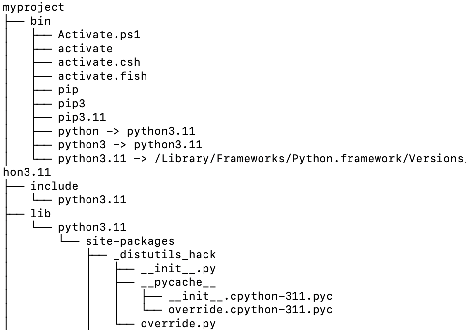

<a href="https://github.com/drshahizan/learn-django/stargazers"></a>
<a href="https://github.com/drshahizan/learn-django/network/members"></a>
<a href="https://github.com/drshahizan/learn-django/pulls"></a>
<a href="https://github.com/drshahizan/learn-django/issues"></a>
<a href="https://github.com/drshahizan/learn-django/graphs/contributors"></a>


Don't forget to hit the :star: if you like this repo.

# Create a virtual environment
A virtual environment is a self-contained environment that allows you to install packages without affecting your system-wide Python installation. 

## How to create a virtual environment
If you've already installed Django, you can still create a virtual environment for your Django projects by following these steps:

1. Open a terminal or command prompt and navigate to the directory where you want to create your virtual environment.

2. Run the following command to create a new virtual environment:
   ```python
   python3 -m venv projek_ST
   ```
   This will create a new directory called "myproject" in your current directory, which will contain the virtual environment.

3. Activate the virtual environment by running the following command:
   ```
   source projek_ST/bin/activate
   ```
   This will activate the virtual environment and you will see the name of the environment in your terminal prompt.

4. Once the virtual environment is activated, you can install any packages you need for your project using pip. Since you've already installed Django globally, you don't need to install it again in your virtual environment. However, if you need to install other packages, you can do so using the following command:
   ```
   pip install package_name
   ```

5. Once you have installed all the necessary packages, you can start working on your Django project as usual.

6. When you are finished working on your project, you can deactivate the virtual environment by running the following command:
   ```
   deactivate
   ```
   This will deactivate the virtual environment and return you to your system's default Python environment.

Overall, using a virtual environment is a good practice that can help you avoid conflicts between different versions of packages and ensure that your projects are self-contained and portable, even if you've already installed Django globally.

## View projek_ST folder
If you have created a virtual environment using the command `python3 -m venv projek_ST`, a new directory called `projek_ST` should have been created in the current directory. You can check the contents of the current directory using the following command:

```python
ls
```

This will list all the files and directories in the current directory. You should see a directory called `projek_ST` listed there. To navigate into the `myproject` directory, you can use the following command:

```python
cd projek_ST
```

This will change your current directory to `myproject`. You can then see the contents of the `myproject` directory by running the `ls` command again. This should show you the files and directories that were created when you created the virtual environment, including a `bin` directory, a `lib` directory, and a `pyvenv.cfg` file.

Overall, once you have created a virtual environment using the `python3 -m venv` command, you can navigate to the directory it was created in and see its contents using standard Unix commands like `ls` and `cd`.

## Display the directory structure: `projek_ST` folder
To display the directory tree structure of your `projek_ST` folder, you can use the `tree` command. However, this command is not available by default on macOS, so you may need to install it first. You can install `tree` using Homebrew, a popular package manager for macOS, by running the following command:

```
brew install tree
```

Once `tree` is installed, you can navigate to the directory where you created your virtual environment (`projek_ST`) and run the following command to display its directory tree structure:

```
tree myproject
```



This will display the tree structure of the `projek_ST` directory, with all its subdirectories and files listed in a hierarchical structure. You should see a directory called `env` inside your `projek_ST` directory, which is the virtual environment that you just created. The `env` directory will contain the Python interpreter and any packages that you install inside the virtual environment.

## Contribution 🛠️
Please create an [Issue](https://github.com/drshahizan/learn-django/issues) for any improvements, suggestions or errors in the content.

You can also contact me using [Linkedin](https://www.linkedin.com/in/drshahizan/) for any other queries or feedback.

[](https://visitorbadge.io/status?path=https%3A%2F%2Fgithub.com%2Fdrshahizan)


