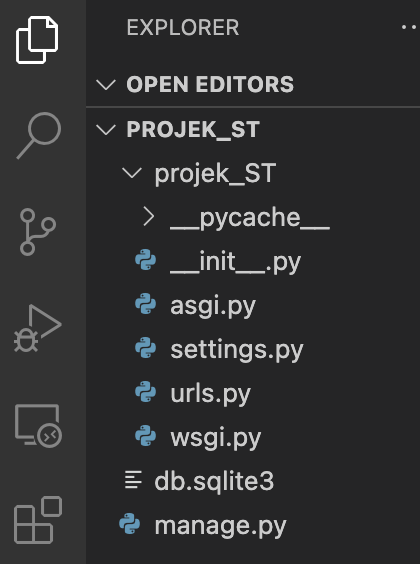
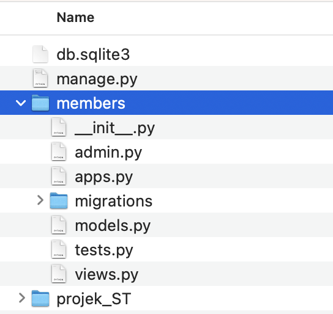
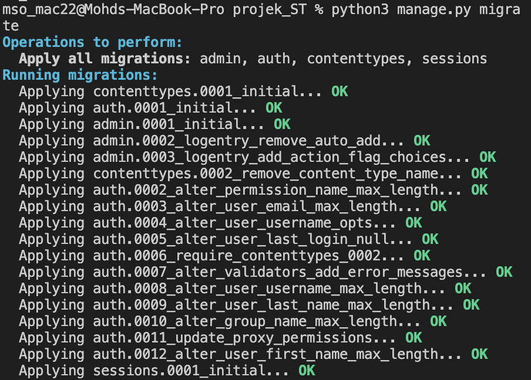
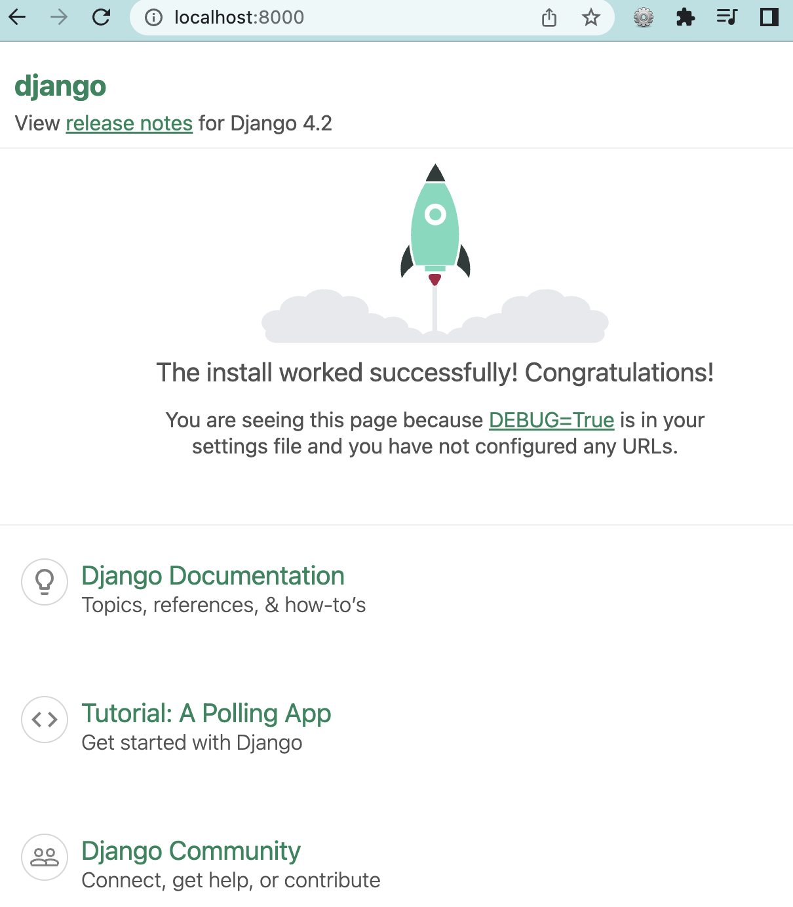

<a href="https://github.com/drshahizan/learn-django/stargazers"></a>
<a href="https://github.com/drshahizan/learn-django/network/members"></a>
<a href="https://github.com/drshahizan/learn-django/pulls"></a>
<a href="https://github.com/drshahizan/learn-django/issues"></a>
<a href="https://github.com/drshahizan/learn-django/graphs/contributors"></a>


Don't forget to hit the :star: if you like this repo.

# Creating a Django App	

Steps to create a new Django project:

### 1. Install Django
If you haven't already installed Django, open your terminal or command prompt and run the following command:

```python
pip install django
```

### 2. Create a new project
Once you have installed Django, you can create a new project by running the following command in your terminal or command prompt:

```python
django-admin startproject projek_ST
```


Replace "projek_ST" with the name you want to give your new Django project. This command will create a new directory with the same name as your project inside the directory where you ran the command.

### 3. Create a new app
Once you have created a new project, you can create a new app by running the following command:

```python
python manage.py startapp appname
```

Replace "appname" with the name you want to give your new app. This command will create a new directory with the same name as your app inside the project directory.




### 4. Define your models
Now that you have created a new app, you can define your models in the models.py file inside the app directory. Models are used to define the data structure of your application.

### 5. Create database tables
Once you have defined your models, you can create database tables by running the following command:

```python
python manage.py makemigrations
```

This command will create a new migration file in the migrations directory inside your app directory.

### 6. Apply database migrations
Once you have created the migration file, you can apply the migrations by running the following command:

```python
python manage.py migrate
```


This command will create the necessary database tables based on the models you have defined.

### 7. Create a view
Now that you have defined your models and created the necessary database tables, you can create a view to display the data. Views are used to handle requests and render responses.

### 8. Define URLs
Once you have created a view, you can define URLs that will map to your views by creating a urls.py file inside your app directory.

### 9. Run the server
Now that you have defined your models, created database tables, created a view, and defined URLs, you can run the development server by running the following command:

```python
python manage.py runserver
```

This command will start the development server, and you can access your application by navigating to http://127.0.0.1:8000/ http://localhost:8000/ or in your web browser.



## Contribution 🛠️
Please create an [Issue](https://github.com/drshahizan/learn-django/issues) for any improvements, suggestions or errors in the content.

You can also contact me using [Linkedin](https://www.linkedin.com/in/drshahizan/) for any other queries or feedback.

[](https://visitorbadge.io/status?path=https%3A%2F%2Fgithub.com%2Fdrshahizan)


